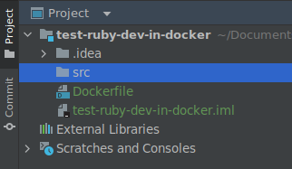
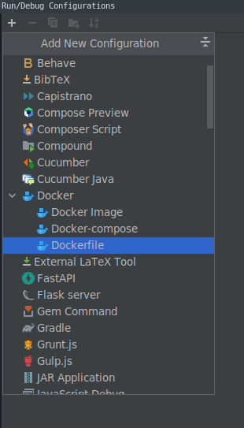
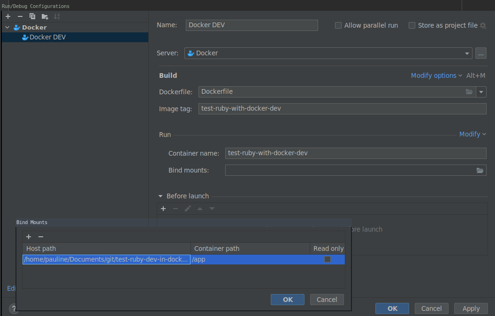
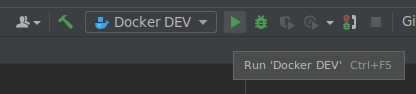
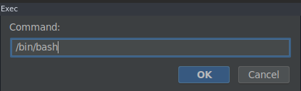
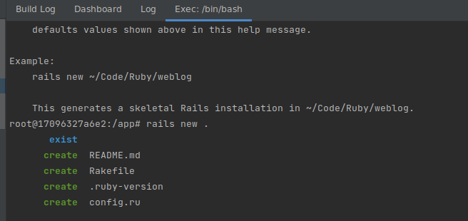
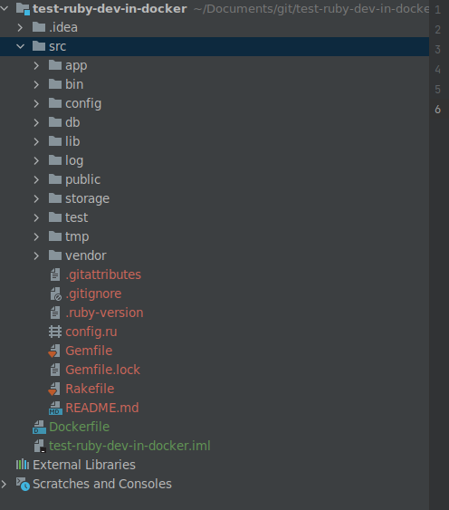
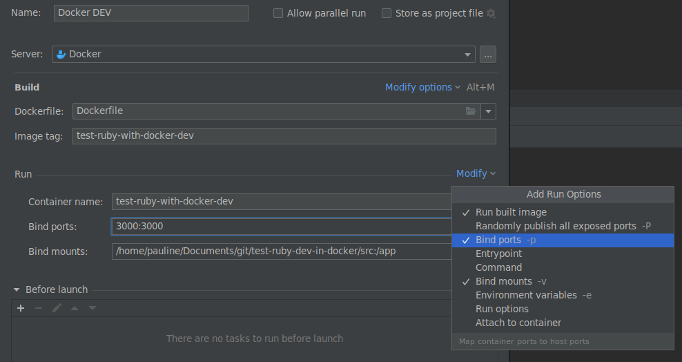
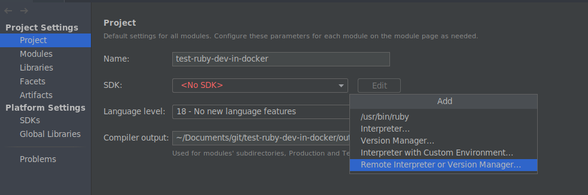
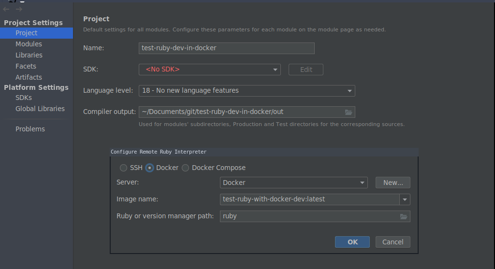

## Ruby Development mit Docker

In diesem Artikel beschreibe ich eins meiner Lieblingssetups für private Ruby-Projekte. 
Eine Docker-Umgebung zur Entwicklung hat viele Vorteile:
- kein Ärger mit verschiedenen Ruby-Versionen
- geringeres Sicherheitsrisiko, da der Container nur Zugriff auf einziges Verzeichnis hat
- bessere Reproduzierbarkeit der Umgebung

### Voraussetzungen

- IntelliJ Pro
- [docker](https://docs.docker.com/engine/install/)


### Anleitung

1. Ruby Plugin installieren und neustarten: Öffne unter Datei > Projekteinstellungen und dann den Reiter Plugins. 
Im marketplace nach dem Ruby-Plugin für IntelliJ suchen und es installieren, falls es noch nicht installiert ist. Dann die IDE neustarten. 


2. Unter File > New > New Project ein neues leeres Projekt erstellen. 


3. Im leeren Projekt ein Verzeichnis `src` und die `Dockerfile` anlegen:  In das `src` Verzeichnis kommt später die eigentliche Anwendung, in das Wurzelverzeichnis Dateien zur Provisionierung wie die Dockerfile und alles andere, was nicht Teil im Container erreichbar sein sollte.
Zum Aufsetzen des Projektes nutze ich meist eine Dockerfile, die ungefähr so aussieht: 
```dockerfile
FROM ruby:3.0

VOLUME /app
WORKDIR /app

CMD sleep infinity
```


4. Neue Dockerfile Config anlegen
   



5. Jetzt kann die neue Config ausgeführt werden.  
Im Tab Services von IntelliJ taucht jetzt unser neuer Container auf. Wir haben als Command `sleep infinty` gewählt, damit wir jetzt Zeit haben, unser Projekt zu konfigurieren.


6. Um unser Projekt zu initialisieren, führen wir die Bash im Container aus. Dafür Rechtsklick auf den Container, Exec > Create and Run. Wir legen das Kommando `/bin/bash` an:


   
7. Jetzt können wir unser Projekt mit unserem ruby im container initialisieren. Zum Beispiel für eine Rails Anwendung führen wir 
`gem install rails && rails new .` aus
   
Damit wird eine Rails Anwendung im Volume`/app`initialisiert. Da der Ordner src aus dem Hostsystem nach /app gemountet wurde, können wir jetzt auch die Dateien im Hostsystem sehen:
   
Die im Docker-Container generierten Dateien gehören dem Nutzer, der den dockerd ausführt. Deshalb muss der Besitzer auf den eigenen Nutzer geändert werden:
`sudo chown -R $(whoami):$(whoami) src `


8. Im nächsten Schritt passen wir die Dockerfile an. Damit wir in IntelliJ CodeCompletion nutzen können, müssen die gems schon zur Build-Time installiert und Bestandteil des Image sein. Außerdem wollen wir zur Laufzeit nicht `sleep infinity`, sondern den Ruby Prozess ausführen. Bei Web-Apps ist zu beachten, dass sie sich nicht an localhost (127.0.0.1) binden sollten, sondern an alle IPs (0.0.0.0)
Die Dockerfile für eine Rails App sieht beispielsweise so aus:
```dockerfile
FROM ruby:3.0

VOLUME /app

WORKDIR /tmp/
# Kopiere die Gemfile ins Image
COPY src/Gemfile .
# installiere gems aus gemfile
RUN bundle install

WORKDIR /app
# development command
CMD rails server -b 0.0.0.0
```
Wenn wir auf Ports zugreifen wollen, müssen wir die IntelliJ Run-Config so anpassen, dass die Ports gepublished werden:

9. Jetzt führen wir das geänderte Docker noch mal über die IntelliJ run Konfiguration aus. Das sorgt dafür, dass das Image eu gebaut wird und der Container gestartet wird.


10. Danach können wir unter "Project structure" unser Ruby SDK im Docker Container konfigurieren. Dafür öffnen wir File > Project Structure >Project.
Im Feld SDK wählen wir Add SDK > Ruby SDK.
    
Jetzt können wir ein Remote Interpreter or Version Manager hinzufügen. Dafür wählen wir den Reiter Docker und stellen sicher, dass unser Image ausgewählt ist:
    
Möglicherweise muss man IntelliJ jetzt neustarten.


11. Jetzt sollte man das Remote Ruby mit Code Completion nutzen können.